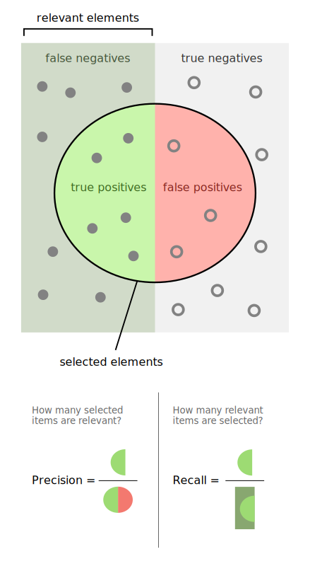

# Métricas de error

En general, el propósito de un modelo de aprendizaje supervisado es **generalizar** el comportamiento de una variable de respuesta, es decir, su capacidad de predecir o estimar correctamente el valor de esta variable en datos **independientes al entrenamiento**. Por tanto, es necesario contar con herramientas que nos permitan evaluar esta capacidad de generalización. 

Una idea sencilla es reducir a un número esta capacidad de generalización, midiendo el error de generalización, esto son lo que llamamos **métricas de error**. Es importante recordar que en general, es necesario calcular estás métricas usando datos independientes a aquellos en los que el modelo fue entrenado, ya que el error de entrenamiento tiende a sobreestimar el error de generalización.

## Métricas para regresión

En regresión, como la variable objetivo es numérica, podemos calcular una medida de discrepancia entre los valores reales y los predichas, a continuación listamos algunas, en todas las medidas $y_i$ es el valor correcto en la fila $i$, y $\hat{y}_i$ es el valor predicho

* Error cuadrático medio: $\sqrt{\displaystyle\frac{1}{n}\sum{(y_i- \hat{y}_i)^2}}$
* Error absoluto medio: $\displaystyle\frac{1}{n}\sum{|y_i - \hat{y}_i|}$
* Desviación mediana absoluta: $median(|y_i - \hat{y}_i|)$
* (pseudo)R2: $1 - MSE/SD(y)$

## Métricas para clasificación binaria
* Tasa de error de clasificación: $\displaystyle\frac{1}{n}\sum{y_i \neq \hat{y}_i}$
* Precisión y recall:



* F1: $2* \displaystyle\frac{precision*recall}{precision+recall}$
* Curva ROC: Gráfica del TPR vs FPR. Un buen predictor tendra un área mayor bajo la curva ROC
```{r}
library(pROC)

target <- Auto$mpg > 35
model <- glm(target~horsepower+weight+displacement, data=Auto)
preds <- model$fitted.values
roc <- roc(target, preds)
print(roc)
plot(roc)
```


## Métricas para clasificación multiclase
* Devianza/Entropía: $\sum y_i log(p_i)$
* Kappa score: $\displaystyle\frac{p_o - p_e}{1 - p_e}$


## K-Fold Cross Validation

Consiste en separar en $K$ "dobleces" nuestro conjunto de entrenamiento, y para cada uno de esos, utilizamos el complemento de los datos para entrenar un modelo y predecir en nuestro doblez. Esto nos ayuda a utilizar los datos disponibles sin partir en varios conjuntos, y nos da una medida más estable de la precisión de nuestro modelo. 


```{r}
library(caret)
library(ISLR)
param.grid <- expand.grid(size=c(16, 32, 64, 128), decay=0:5)

train_x <- Auto[c("horsepower", "weight", "displacement", "cylinders")]
target <- Auto$mpg
tr <- trainControl("cv", 10)

model <- caret::train(train_x, target, method="nnet", trControl=tr, tuneGrid=param.grid, trace=F)
model
```

```{r}
target <- factor(Auto$origin)
model <- caret::train(train_x, target, method="nnet", trControl=tr, tuneGrid=param.grid, trace=F, MaxNWts = 10000)
model
```

## LOO
Es el caso más extremo de k-fold cross validation, donde $k=n$, el tamaño de los datos. Esto nos permite calcular una medida del error de generalización **en cada punto del conjunto de datos**. Sin embargo, puede ser muy costoso de calcular, ya que necesitamos ajustar $n$ modelos.

## Bootstrap
Toma muestras de tamaño fijo **con reemplazo**, entrena en estas muestras y predice en el resto del conjunto de entrenamiento. En realidad Bootstrap es una técnica que nos ayuda a estimar la dispersión de cualquier estadística, ya que para cada muestra calculamos una realización de la distribución de dicha estadística, de la que podemos calcular el error estándar o cualquier otra medida

```{r}
library(caret)
library(ISLR)
param.grid <- expand.grid(size=c(16, 32, 64), decay=c(0, 1))
train_x <- Auto[c("horsepower", "weight", "displacement", "cylinders")]
target <- Auto$mpg
tr <- trainControl("boot")

model <- caret::train(train_x, target, method="nnet", trControl=tr, tuneGrid=param.grid, trace=F)
model
```

```{r}
target <- factor(Auto$origin)
model <- caret::train(train_x, target, method="nnet", trControl=tr, tuneGrid=param.grid, trace=F, MaxNWts = 10000)
model
```
```{r}
?caret::train
```

